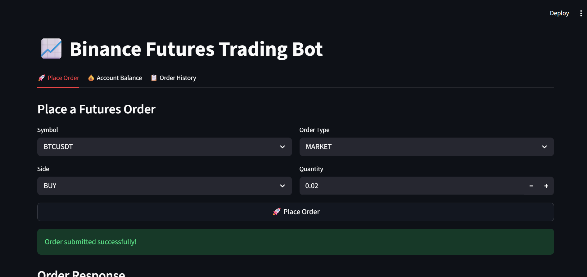
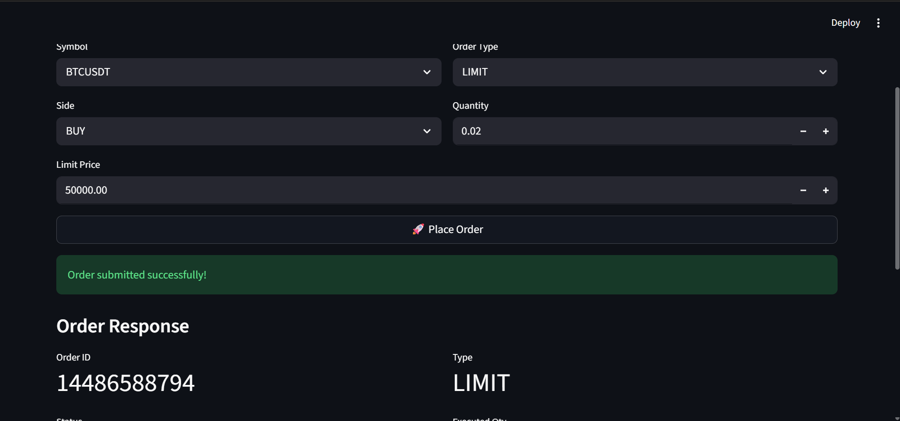
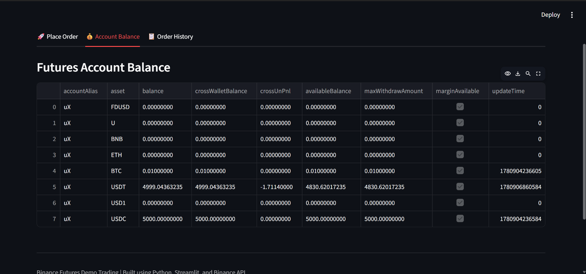

# Binance Futures Trading Bot


The application integrates with Binance Futures Demo Trading (Testnet) and supports placing Market and Limit orders through both a Command Line Interface (CLI) and a lightweight Streamlit-based web dashboard.

---

## Features

### Core Requirements

* Place **Market Orders**
* Place **Limit Orders**
* Support **BUY** and **SELL** sides
* Binance Futures Demo/Testnet API integration
* CLI-based order placement using argparse
* Input validation
* Structured project architecture
* Logging of requests, responses, and errors
* Exception handling for API and runtime errors

### Bonus Features

* Lightweight Streamlit Dashboard
* Account Balance Viewer
* Order History Viewer
* User-friendly Trading Interface

---

## Project Structure

```text
trading_bot/
│
├── bot/
│   ├── __init__.py
│   ├── client.py
│   ├── orders.py
│   ├── validators.py
│   └── logging_config.py
│
├── logs/
│   └── trading_bot.log
│
├── app.py
├── cli.py
├── .env.example
├── .gitignore
├── requirements.txt
└── README.md
```

---

## Technology Stack

* Python 3.x
* Binance Futures API
* python-binance
* Streamlit
* Pandas
* argparse
* dotenv
* logging

---

## Setup Instructions

### 1. Clone Repository

```bash
git clone <repository_url>
cd trading_bot
```

### 2. Install Dependencies

```bash
pip install -r requirements.txt
```

### 3. Configure Environment Variables

Create a `.env` file in the project root:

```env
BINANCE_API_KEY=YOUR_API_KEY
BINANCE_API_SECRET=YOUR_API_SECRET
```

Use Binance Futures Demo/Testnet API credentials.

---

## Running the Application

### CLI Mode

#### Market Order

```bash
py cli.py --symbol BTCUSDT --side BUY --type MARKET --quantity 0.001
```

Example Output:

```text
===== ORDER RESPONSE =====

Order ID : 14485645917
Status   : FILLED
Executed : 0.0010
Avg Price: 63126.000000
Side     : BUY
Type     : MARKET
```

---

#### Limit Order

```bash
py cli.py --symbol BTCUSDT --side SELL --type LIMIT --quantity 0.001 --price 200000
```

Example Output:

```text
===== ORDER RESPONSE =====

Order ID : 14485668410
Status   : NEW
Executed : 0.0000
Avg Price: None
Side     : SELL
Type     : LIMIT
```

---

### Streamlit Dashboard

Launch the dashboard:

```bash
py -m streamlit run app.py
```

The dashboard provides:

* Order Placement Interface
* Account Balance View
* Order History View
* Real-Time Order Responses

---

## Validation Rules

The application validates:

* Symbol format
* BUY/SELL side
* MARKET/LIMIT order type
* Positive quantity values
* Price requirement for LIMIT orders

---

## Logging

Logs are stored in:

```text
logs/trading_bot.log
```

Logged Information:

* Order Requests
* Order Responses
* API Errors
* Runtime Errors

---

## Error Handling

Implemented handling for:

* Invalid user inputs
* Binance API exceptions
* Authentication failures
* Network-related errors
* Unexpected runtime exceptions

---

## Screenshots

### Dashboard

The Streamlit dashboard provides a simple and user-friendly interface for placing futures orders, viewing account balances, and checking order history.



---

### Successful Market Order

Example of a successfully executed MARKET BUY order.


---

### Successful Limit Order

Example of a LIMIT SELL order successfully placed and waiting in the order book.



---

### Account Balance

Displays Binance Futures Demo account balances retrieved through the API.



---

### Order History

Shows recent futures orders and their status.


## Assignment Requirements Mapping

| Requirement                 | Status |
| --------------------------- | ------ |
| Market Orders               | ✅      |
| Limit Orders                | ✅      |
| BUY Orders                  | ✅      |
| SELL Orders                 | ✅      |
| CLI Interface               | ✅      |
| Validation                  | ✅      |
| Logging                     | ✅      |
| Error Handling              | ✅      |
| Binance Futures Integration | ✅      |
| Structured Codebase         | ✅      |
| README Documentation        | ✅      |
| Bonus UI                    | ✅      |

---

## Author

Ashutosh Kumar Singh

B.Tech – Computer Science & Information Technology

KIET Group of Institutions

GitHub: [https://github.com/Ashutosh0540]

LinkedIn: [https://www.linkedin.com/in/ashutosh-kumar-singh-086546210/]
